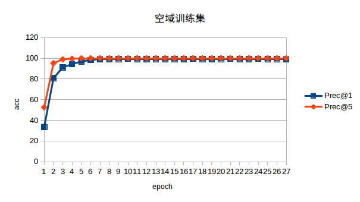
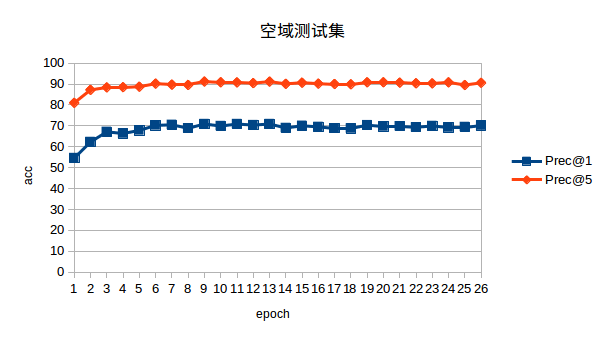
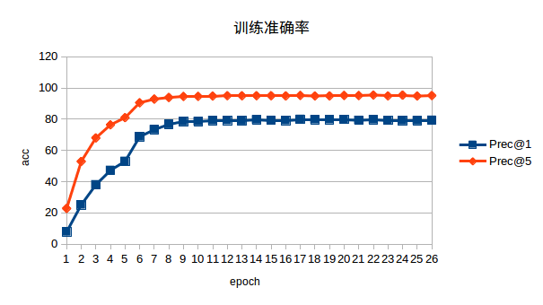
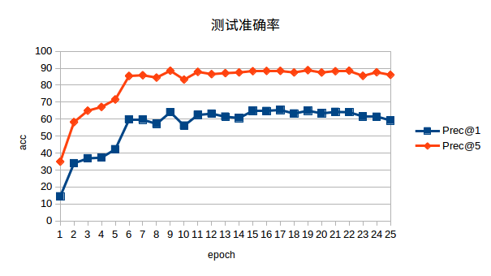

####                                                                                                                                                                                                                                                                                                                                                                                                                                                                                                                                                                                                                                                                                                                                                                                                                                                                                                                                                                                                                                                                                                                                                                                                                                                                                                                                                                                                                                                                                                                                                                                                                                                                                                                                                                                                                                                                                                                                                                                                                                                                                                                                                                                                                                                                                                                                                                                                                                                                                                                                                                                                                                                                                                                                                                                                                                                                                                                                                                                                                                                                                                                                                                                                                                                                                                                                                                                                                                                                                                                                                                                                                                                                                                                                                                                                                                                                                                                                                                                                                                                                                                                                                                                                                                                                                                                                                                                                                                                                                                                                                                                                                                                                                                                                                                                                                                                                                                                                                                                                                                                                                                                                                                                                                                                                                                                                                                                                                                                                                                                                                                                                                                                                                                                                                                                                                                                                                                                                                                                                                                                                                                                                                                                                                                                                                                                                                                                                                                                                                                                                                                                                                                                                                                                                                                                                                                                                                                                                                                                                                                                                                                                                                                                                                                                                                                                                                                                                                                                                                                                                                                                                                                                                                                                                                                                                                                                                                                                                                                                                                                                                                                                           ResNet18      

### 1、时域

- 针对resnet18网络框架在**时域**做行为识别。

   依据之前的策略开始进行训练，首先下载resnet18网络模型，然后开始进行迁移学习，其结果如下：

```
Namespace(batch_size=32, epochs=500, evaluate=False, lr=0.01, resume='', start_epoch=0)
==> (Training video, Validation video):( 9537 3783 )
==> Training data : 9537  videos (20L, 224L, 224L)
==> Validation data : 71877  frames (20L, 224L, 224L)
==> Build model and setup loss and optimizer
Downloading: "https://download.pytorch.org/models/resnet18-5c106cde.pth" to /home/victorleelk/.torch/models/resnet18-5c106cde.pth
100%|██████████████████████████| 46827520/46827520 [03:21<00:00, 232598.90it/s]
==> Epoch:[0/500][training stage]
100%|████████████████████████████████████████| 299/299 [57:33<00:00, 11.55s/it]
Time [11.55] Data [10.92] 
Loss [3.71979] Prec@1 [14.9523] Prec@5 [36.5314]
LR 0.01

==> Epoch:[0/500][validation stage]
100%|████████████████████████████████████| 2247/2247 [5:23:52<00:00,  8.65s/it]
Time [8.648] 
Loss [45.74055] Prec@1 [10.283] Prec@5 [33.994] 

==> Epoch:[1/500][training stage]
100%|████████████████████████████████████████| 299/299 [51:13<00:00, 10.28s/it]
Time [10.28] Data [10.204] 
Loss [2.5373] Prec@1 [36.3532] Prec@5 [66.6876]
LR 0.01

==> Epoch:[1/500][validation stage]
100%|████████████████████████████████████| 2247/2247 [5:11:56<00:00,  8.33s/it]
Time [8.329] 
Loss [37.66371] Prec@1 [21.861] Prec@5 [59.186] 

==> Epoch:[2/500][training stage]
100%|████████████████████████████████████████| 299/299 [51:49<00:00, 10.40s/it]
Time [10.4] Data [10.324] 
Loss [2.04421] Prec@1 [46.199] Prec@5 [76.7432]
LR 0.01

==> Epoch:[2/500][validation stage]
100%|████████████████████████████████████| 2247/2247 [5:14:38<00:00,  8.40s/it]
Time [8.402] 
Loss [21.02473] Prec@1 [42.585] Prec@5 [71.398] 
```


`训练集：`

| Epoch | Batch Time | Data Time | Loss | Prec@1 | Prec@5 | lr   |
| ----- | ---------- | --------- | ---- | ------ | ------ | ---- |
|       |            |           |      |        |        |      |

| 0    | 11.55  | 10.92  | 3.71979 | 14.9523 | 36.5314 | 0.01     |
| ---- | ------ | ------ | ------- | ------- | ------- | -------- |
| 1    | 10.28  | 10.204 | 2.5373  | 36.3532 | 66.6876 | 0.01     |
| 2    | 10.4   | 10.324 | 2.04421 | 46.199  | 76.7432 | 0.01     |
| 3    | 10.44  | 10.361 | 1.80323 | 51.4418 | 80.7906 | 0.01     |
| 4    | 10.348 | 10.274 | 1.52283 | 58.5719 | 85.3623 | 0.01     |
| 5    | 10.317 | 10.243 | 1.08889 | 69.8123 | 90.7938 | 0.001    |
| 6    | 11.44  | 11.328 | 0.92925 | 74.2267 | 92.9118 | 0.001    |
| 7    | 10.288 | 10.212 | 0.86421 | 76.1141 | 93.8345 | 0.001    |
| 8    | 10.285 | 10.213 | 0.83149 | 76.89   | 94.1386 | 0.001    |
| 9    | 10.225 | 10.152 | 0.80177 | 78.1378 | 94.3483 | 0.001    |
| 10   | 12.316 | 12.17  | 0.77007 | 78.8298 | 95.0718 | 0.001    |
| 11   | 12.338 | 12.115 | 0.73056 | 79.9518 | 95.1662 | 0.001    |
| 12   | 12.72  | 12.573 | 0.70524 | 80.7172 | 95.4598 | 0.001    |
| 13   | 9.999  | 9.919  | 0.6975  | 80.7591 | 95.4912 | 0.001    |
| 14   | 9.961  | 9.891  | 0.67097 | 81.6504 | 95.7324 | 0.0001   |
| 15   | 10.039 | 9.967  | 0.64248 | 82.6675 | 96.3196 | 0.0001   |
| 16   | 9.927  | 9.856  | 0.64439 | 82.1223 | 96.047  | 0.00001  |
| 17   | 9.873  | 9.797  | 0.63872 | 82.3634 | 96.0784 | 0.00001  |
| 18   | 9.903  | 9.828  | 0.62646 | 83.1079 | 96.2672 | 0.000001 |
| 19   | 10.218 | 10.145 | 0.63782 | 82.7094 | 96.1309 | 0.000001 |

`测试集：`

| 6    | 8.664  | 9.63441 | 71.636 | 91.541 |
| ---- | ------ | ------- | ------ | ------ |
| 7    | 8.807  | 9.16125 | 73.962 | 92.387 |
| 8    | 8.701  | 9.01049 | 73.962 | 92.017 |
| 9    | 9.206  | 9.79241 | 73.196 | 91.673 |
| 10   | 9.947  | 8.58347 | 75.284 | 93.418 |
| 11   | 10.218 | 8.15854 | 76.051 | 93.55  |
| 12   | 9.373  | 8.98869 | 74.861 | 92.969 |
| 13   | 7.88   | 9.3864  | 74.147 | 92.07  |
| 14   | 7.998  | 8.65429 | 75.284 | 93.18  |
| 15   | 7.858  | 8.595   | 75.337 | 92.969 |
| 16   | 7.884  | 8.55272 | 76.315 | 93.391 |
| 17   | 7.722  | 9.10256 | 74.28  | 92.651 |
| 18   | 7.783  | 8.9808  | 76.077 | 93.048 |

整个训练及测试时间达到了4天多，其最好的结果为top1  :$\color{red}{ 76.315\% }$

```Loss [8.55272] Prec@1 [76.315] Prec@5 [93.391] ```

与之相对比的是resnet101网络，top1为：79.672%


#### 2、空域

```
python spatial_cnn.py 
Namespace(batch_size=25, epochs=500, evaluate=False, lr=0.0005, resume='', start_epoch=0)
==> (Training video, Validation video):( 9537 3783 )
==> Loading frame number of each video
==> sampling testing frames
==> Training data : 9537 frames
(3L, 224L, 224L)
==> Validation data : 71877 frames
(3L, 224L, 224L)
==> Build model and setup loss and optimizer
==> Epoch:[0/500][training stage]
100%|█████████████████████████████████████████| 382/382 [33:10<00:00,  5.21s/it]
Time [5.211] Data [4.612] 
Loss [2.25475] Prec@1 [49.3237] Prec@5 [71.144]
LR 0.0005

==> Epoch:[0/500][validation stage]
100%|███████████████████████████████████████| 2876/2876 [55:44<00:00,  1.16s/it]
Time [1.163] 
Loss [4.49144] Prec@1 [61.168] Prec@5 [86.519] 

==> Epoch:[1/500][training stage]
100%|█████████████████████████████████████████| 382/382 [26:45<00:00,  4.20s/it]
Time [4.202] Data [4.048] 
Loss [0.631] Prec@1 [85.2994] Prec@5 [97.6198]
LR 0.0005

==> Epoch:[1/500][validation stage]
100%|███████████████████████████████████████| 2876/2876 [45:31<00:00,  1.05it/s]
Time [0.95] 
Loss [4.11913] Prec@1 [67.803] Prec@5 [89.691] 

==> Epoch:[2/500][training stage]
100%|█████████████████████████████████████████| 382/382 [26:32<00:00,  4.17s/it]
Time [4.169] Data [4.016] 
Loss [0.34814] Prec@1 [92.7965] Prec@5 [99.287]
LR 0.0005

==> Epoch:[2/500][validation stage]
100%|███████████████████████████████████████| 2876/2876 [39:19<00:00,  1.22it/s]
Time [0.82] 
Loss [4.22929] Prec@1 [69.654] Prec@5 [90.404] 

==> Epoch:[3/500][training stage]
100%|█████████████████████████████████████████| 382/382 [25:23<00:00,  3.99s/it]
Time [3.989] Data [3.834] 
Loss [0.22722] Prec@1 [95.7114] Prec@5 [99.7274]
LR 0.0005

==> Epoch:[3/500][validation stage]
100%|███████████████████████████████████████| 2876/2876 [35:57<00:00,  1.33it/s]
Time [0.75] 
Loss [4.04706] Prec@1 [71.293] Prec@5 [91.938] 
```

**`训练集`**

| Epoch | Batch Time | Data Time | Loss    | Prec@1  | Prec@5  | lr          |
| ----- | ---------- | --------- | ------- | ------- | ------- | ----------- |
| 0     | 5.211      | 4.612     | 2.25475 | 49.3237 | 71.144  | 0.0005      |
| 1     | 4.202      | 4.048     | 0.631   | 85.2994 | 97.6198 | 0.0005      |
| 2     | 4.169      | 4.016     | 0.34814 | 92.7965 | 99.287  | 0.0005      |
| 3     | 3.989      | 3.834     | 0.22722 | 95.7114 | 99.7274 | 0.0005      |
| 4     | 4.189      | 4.031     | 0.16261 | 97.148  | 99.7903 | 0.0005      |
| 5     | 4.179      | 4.026     | 0.12236 | 98.1231 | 99.9161 | 0.0005      |
| 6     | 3.882      | 3.728     | 0.09532 | 98.8151 | 99.9895 | 0.00005     |
| 7     | 4.069      | 3.911     | 0.0937  | 98.9619 | 99.9581 | 0.00005     |
| 8     | 4.104      | 3.941     | 0.09017 | 98.9095 | 100     | 0.000005    |
| 9     | 4.314      | 4.159     | 0.08836 | 99.0668 | 99.979  | 0.000005    |
| 10    | 4.513      | 4.359     | 0.08652 | 99.0668 | 99.9685 | 0.0000005   |
| 11    | 3.983      | 3.829     | 0.08764 | 99.0039 | 99.9581 | 0.0000005   |
| 12    | 4.33       | 4.173     | 0.08943 | 98.8885 | 100     | 0.0000005   |
| 13    | 4.135      | 3.983     | 0.08718 | 99.1402 | 99.979  | 0.00000005  |
| 14    | 4.595      | 4.437     | 0.08939 | 98.9619 | 99.979  | 0.00000005  |
| 15    | 4.475      | 4.326     | 0.09008 | 98.9829 | 99.979  | 0.000000005 |
| 16    | 4.443      | 4.288     | 0.08823 | 99.0982 | 99.9685 | 0.000000005 |


**`测试集`**

| Epoch | Batch Time | Loss    | Prec@1                | Prec@5 |
| ----- | ---------- | ------- | --------------------- | ------ |
| 0     | 1.163      | 4.49144 | 61.168                | 86.519 |
| 1     | 0.95       | 4.11913 | 67.803                | 89.691 |
| 2     | 0.82       | 4.22929 | 69.654                | 90.404 |
| 3     | 0.75       | 4.04706 | 71.293                | 91.938 |
| 4     | 0.651      | 4.22076 | 71.98                 | 92.149 |
| 5     | 0.661      | 4.30669 | 72.033                | 92.361 |
| 6     | 0.584      | 4.29028 | 71.953                | 92.043 |
| 7     | 0.528      | 4.31007 | 72.059                | 92.361 |
| 8     | 0.658      | 4.38705 | 72.297                | 91.858 |
| 9     | 0.642      | 4.24382 | 72.033                | 92.096 |
| 10    | 0.54       | 3.84677 | 73.751                | 93.127 |
| 11    | 0.598      | 4.35221 | 71.927                | 91.938 |
| 12    | 0.445      | 4.19985 | 72.139                | 92.651 |
| 13    | 0.672      | 4.41117 | 71.24                 | 91.409 |
| 14    | 0.648      | 4.06631 | 72.456                | 92.784 |
| 15    | 0.704      | 4.08131 | $\color{red}{73.883}$ | 93.074 |
| 16    | 0.569      | 4.42937 | 71.345                | 91.753 |

#### **3、resnet18融合结果**

| fusion策略        | top1                   | top5    |
| --------------- | ---------------------- | ------- |
| average         | 85.6727                | 97.0130 |
| max             | 76.5001                | 93.7880 |
| 加权均值(空域取1，时域取2) | 82.6064                | 96.0349 |
| 加权均值(空域取2，时域取1) | $\color{red}{87.4438}$ | 97.5681 |

-------------------------------------

------------------

-----------------------------

--------------------


#### 4、分割片段最大值融合讨论-------空域

```
CUDA_VISIBLE_DEVICES=0 python spatial_cnn.py 
Namespace(batch_size=25, epochs=500, evaluate=False, lr=0.0005, resume='', start_epoch=0)
```


在经过26个epoch训练，每个epoch53分钟左右，共约24小时训练

在第25个epoch时，此时学习速率达到5e-9，学习正确率达到$\color{red}69.046%$

==> Epoch:[25/500][training stage]
100%|█████████████████████████████████████████| 382/382 [33:49<00:00,  5.31s/it]
Time [5.313] Data [5.218] 
Loss [0.40361] Prec@1 [93.5724] Prec@5 [95.8268]
LR 5e-09

==> Epoch:[25/500][validation stage]
100%|███████████████████████████████████████| 2876/2876 [19:38<00:00,  2.44it/s]
Time [0.41] 
Loss [11.46529] Prec@1 [69.046] Prec@5 [88.369] 

之前采用均值的情况下，其效果达到了**$\color{red}73.883%$**。

> 说明分割片段取均值效果好于去最大值。


#### 5、分割片段基于方差加权融合讨论

视频分成3个片段，每一个片段对行为的重要性不是一样的，所以考虑给每一个分割的输出特征（预测）赋予一定权重。

> 基本依据：重要性越大的片段，其对最终的准确率贡献越大。在分割片段预测的特征表现上，主要是在正确预测的位置其特征值(概率值)越大，而在其他类别预测概率值越小。因此一般情况下，重要性越大的片段其预测的结果101类别数值约离散，考虑采用方差来进行加权求和。

- **空域**

```
python spatial_cnn.py 
Namespace(batch_size=25, epochs=500, evaluate=False, lr=0.0005, resume='', start_epoch=0)
==> (Training video, Validation video):( 9537 3783 )
==> Loading frame number of each video
==> sampling testing frames
==> Training data : 9537 frames
(3L, 224L, 224L)
```

每一个epoch时间约为1个小时左右，经过26个epoch的训练，在第8个epoch时，达到最大值$\color{red}{70.896\%}$

> ==> Epoch:[8/500][training stage]
>
> 100%|█████████████████████████████████████████| 382/382 [32:23<00:00,  5.09s/it]
> Time [5.087] Data [4.973] 
> Loss [0.03101] Prec@1 [99.2241] Prec@5 [99.979]
> LR 5e-06
>
> ==> Epoch:[8/500][validation stage]
> 100%|███████████████████████████████████████| 2876/2876 [26:11<00:00,  1.83it/s]
> Time [0.546] 
> Loss [3.72328] Prec@1 [70.896] Prec@5 [91.197] 






​                                                          不同分割融合方案下resnet18**空域**识别准确率

| 分割融合方案 | top-1                 | top-5  |
| ------ | --------------------- | ------ |
| 均值     | $\color{red}{73.883}$ | 93.074 |
| max    | 69.046                | 88.369 |
| 方差     | 70.896                | 91.197 |


- **时域**

  当前训练，每个epoch训练时间达到3.5个小时。

  测试集合准确率： $ \color{red}65.398\%$

```
Namespace(batch_size=32, epochs=500, evaluate=False, lr=0.01, resume='', start_epoch=0)
==> (Training video, Validation video):( 9537 3783 )
==> Training data : 9537  videos (20L, 224L, 224L)
==> Validation data : 71877  frames (20L, 224L, 224L)
==> Build model and setup loss and optimizer
```

​                                                          不同分割融合方案下resnet18**时域**识别准确率

| 分割融合方案 | top-1    | top-5  |
| ------ | -------- | ------ |
| 均值     | $76.315$ | 93.391 |
| max    |          |        |
| 方差     | 65.398   | 88.448 |






#### **6、resnet18基于方差预测时域空域融合结果**

| fusion策略        |          top1          |         |  top5   |         |
| :-------------- | :--------------------: | :-----: | :-----: | :-----: |
|                 |           均值           |   var   |   均值    |   var   |
| average         |        85.6727         | 83.0293 | 97.0130 | 96.4314 |
| max             |        76.5001         | 71.1605 | 93.7880 | 91.5675 |
| 加权均值(空域取1，时域取2) |        82.6064         | 83.9017 | 96.0349 | 96.9336 |
| 加权均值(空域取2，时域取1) | $\color{red}{87.4438}$ | 79.1700 | 97.5681 | 95.0833 |
| var[top 5]      |        82.6857         | 79.9894 | 95.9027 | 95.1626 |
| var             |        78.3770         | 73.0637 | 94.6075 | 92.0698 |

`训练集`

| Epoch | Batch Time | Data Time | Loss    | Prec@1  | Prec@5  | lr         |
| ----- | ---------- | --------- | ------- | ------- | ------- | ---------- |
| 0     | 25.269     | 25.029    | 4.46121 | 2.9569  | 12.0478 | 0.01       |
| 1     | 24.795     | 24.683    | 4.54572 | 1.7301  | 8.336   | 0.01       |
| 2     | 24.73      | 24.611    | 4.51347 | 2.1286  | 8.9231  | 0.01       |
| 3     | 24.171     | 24.048    | 4.52242 | 2.0447  | 9.1119  | 0.01       |
| 4     | 24.353     | 24.234    | 4.49333 | 2.4117  | 9.9717  | 0.01       |
| 5     | 24.349     | 24.24     | 4.50378 | 2.4955  | 9.9612  | 0.01       |
| 0     | 24.805     | 24.56     | 4.22565 | 7.9061  | 22.8583 | 0.01       |
| 1     | 24.005     | 23.878    | 3.19111 | 25.1651 | 52.9097 | 0.01       |
| 2     | 24.216     | 24.094    | 2.52567 | 37.9994 | 68.0088 | 0.01       |
| 3     | 23.982     | 23.855    | 2.10215 | 47.2476 | 76.3762 | 0.01       |
| 4     | 23.539     | 23.416    | 1.8416  | 53.0146 | 80.9793 | 0.01       |
| 5     | 23.537     | 23.412    | 1.15592 | 68.7533 | 90.4897 | 0.001      |
| 6     | 23.551     | 23.426    | 0.97755 | 73.2935 | 92.8384 | 0.001      |
| 7     | 24.338     | 24.192    | 0.85384 | 76.6593 | 93.845  | 0.001      |
| 8     | 23.669     | 23.544    | 0.77712 | 78.4419 | 94.5371 | 0.0001     |
| 9     | 23.777     | 23.653    | 0.75409 | 78.4628 | 94.5685 | 0.0001     |
| 10    | 23.503     | 23.379    | 0.74417 | 79.0605 | 94.7782 | 0.0001     |
| 11    | 23.65      | 23.525    | 0.7464  | 79.1758 | 94.9984 | 0.00001    |
| 12    | 23.77      | 23.648    | 0.74598 | 78.9766 | 94.967  | 0.00001    |
| 13    | 24.273     | 24.154    | 0.72398 | 79.5953 | 95.0089 | 0.000001   |
| 14    | 24.456     | 24.338    | 0.73356 | 79.2597 | 95.0089 | 0.000001   |
| 15    | 24.631     | 24.511    | 0.7405  | 79.1024 | 94.8726 | 0.000001   |
| 16    | 24.58      | 24.46     | 0.72095 | 79.9203 | 95.1872 | 0.000001   |
| 17    | 24.537     | 24.416    | 0.72801 | 79.6687 | 94.8202 | 0.000001   |
| 18    | 24.553     | 24.432    | 0.72271 | 79.7421 | 94.8831 | 0.0000001  |
| 19    | 24.317     | 24.2      | 0.71431 | 79.7945 | 95.1662 | 0.0000001  |
| 20    | 24.285     | 24.168    | 0.73353 | 79.2597 | 95.1138 | 0.0000001  |
| 21    | 24.584     | 24.465    | 0.72012 | 79.6477 | 95.4074 | 0.00000001 |
| 22    | 24.625     | 24.504    | 0.73097 | 79.1863 | 94.8726 | 0.00000001 |
| 23    | 24.653     | 24.534    | 0.72412 | 79.0395 | 95.3759 | 0.00000001 |
| 24    | 24.53      | 24.412    | 0.74758 | 79.05   | 94.7887 | 0.00000001 |
| 25    | 24.561     | 24.442    | 0.73348 | 79.3017 | 95.0928 | 0.00000001 |

`测试集：`

| Epoch | Batch Time | Loss    | Prec@1 | Prec@5 |
| ----- | ---------- | ------- | ------ | ------ |
| 0     | 8.442      | 7.00049 | 14.459 | 34.919 |
| 1     | 8.459      | 4.98857 | 33.968 | 58.261 |
| 2     | 8.46       | 4.24086 | 36.875 | 64.975 |
| 3     | 8.558      | 4.81967 | 37.298 | 67.169 |
| 4     | 8.364      | 4.38219 | 42.242 | 71.583 |
| 5     | 8.286      | 2.34481 | 59.794 | 85.435 |
| 6     | 8.845      | 2.42286 | 59.767 | 85.858 |
| 7     | 8.29       | 2.68846 | 57.203 | 84.483 |
| 8     | 8.288      | 2.12635 | 64.076 | 88.528 |
| 9     | 8.293      | 2.75542 | 56.172 | 83.294 |
| 10    | 8.264      | 2.13655 | 62.464 | 87.867 |
| 11    | 8.438      | 2.25306 | 63.204 | 86.519 |
| 12    | 8.477      | 2.36853 | 61.459 | 87.1   |
| 13    | 8.569      | 2.38655 | 60.666 | 87.497 |
| 14    | 8.621      | 2.06248 | 64.816 | 88.263 |
| 15    | 8.598      | 2.0293  | 64.763 | 88.395 |
| 16    | 8.708      | 2.06622 | 65.398 | 88.448 |
| 17    | 8.612      | 2.23635 | 63.283 | 87.497 |
| 18    | 8.556      | 1.99092 | 64.975 | 88.845 |
| 19    | 8.479      | 2.10156 | 63.389 | 87.47  |
| 20    | 8.501      | 2.0582  | 64.261 | 88.237 |
| 21    | 8.616      | 2.0565  | 64.076 | 88.554 |
| 22    | 8.619      | 2.51917 | 61.486 | 85.488 |
| 23    | 8.65       | 2.35809 | 61.38  | 87.602 |
| 24    | 8.626      | 2.4572  | 59.239 | 86.069 |